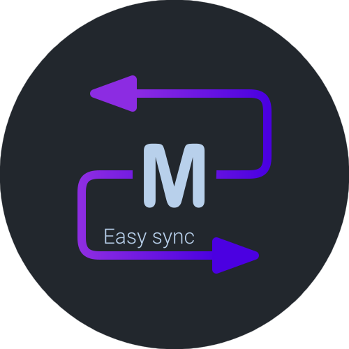
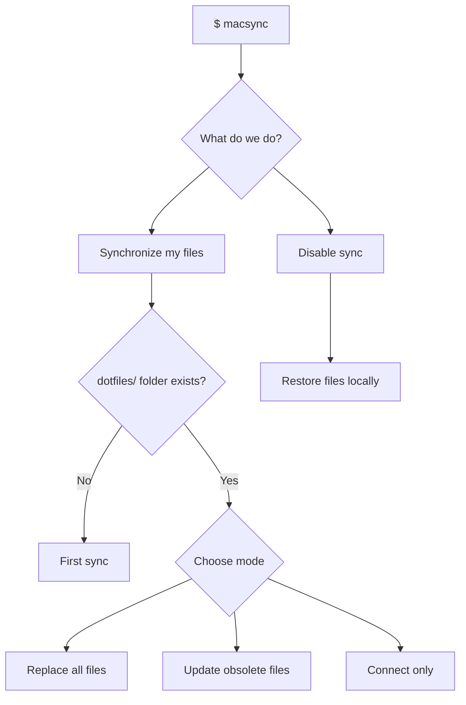

<p align="center">
  <a href="https://github.com/Pilaton/MacSync">
    
  </a>
</p>

<h3 align="center">Easy sync for macOS. Dotfiles, folders, configs — anything.</h3>

<p align="center">
  <a href="https://github.com/Pilaton/MacSync/blob/main/LICENSE"></a>
  <a href="https://github.com/Pilaton/MacSync/releases"></a>
  
  
  
</p>

---

Sync files and folders across Macs using **Dropbox**, **iCloud**, **Google Drive**, **OneDrive**, **Yandex.Disk**, **NAS**, or any folder that syncs between devices.

MacSync moves files to a sync folder and creates symlinks in their place. Edit on one Mac — changes appear on all others. Works with dotfiles, app configs, scripts, projects — anything.

## Contents

- [Contents](#contents)
- [Quick Start](#quick-start)
- [Sync Modes](#sync-modes)
- [Disabling Sync](#disabling-sync)
- [CLI Reference](#cli-reference)
- [How It Works](#how-it-works)
- [Security Considerations](#security-considerations)
- [Troubleshooting](#troubleshooting)
- [FAQ](#faq)
- [Requirements](#requirements)
- [Changelog](#changelog)

## Quick Start

**1. Install**

```sh
brew install pilaton/tap/macsync
```

<details>
<summary>Manual installation</summary>

```sh
git clone https://github.com/Pilaton/MacSync.git ~/.macsync-app
ln -s ~/.macsync-app/bin/macsync /usr/local/bin/macsync
```

</details>

**2. Configure** — edit `~/.macsync/config.cfg` (created on first run):

```sh
# Where to store synced files (must be accessible from all your Macs)
SYNC_FOLDER=~/Dropbox/MacSync

# What to sync (paths relative to ~)
BACKUP_FILES=(
  .zshrc
  .gitconfig
  .config/nvim
  .ssh/config
)
```

**3. Run**

```sh
macsync
```

That's it. Your files are now in the sync folder, symlinked locally.

## Sync Modes



**Connection options** (when `dotfiles/` folder exists):

| Option | What happens | When to use |
| :----- | :------------ | :---------- |
| **Replace all files** | Deletes the `dotfiles/` folder, then uploads your local files fresh | Starting fresh, or when local files are the source of truth |
| **Update obsolete files** | Uploads your local files, overwriting any existing files in sync folder | When you want to add or update files in sync folder |
| **Connect only** | Just creates symlinks to existing files without uploading anything | When sync folder already has the correct files and you just need to link them |

## Disabling Sync

Select "Disable sync" in the menu. MacSync will:

1. Copy files back from sync folder to their original locations
2. Remove symlinks
3. Files in sync folder remain unchanged

## CLI Reference

```sh
macsync                              # Interactive mode
macsync --dry-run                    # Preview without changes
macsync --sync-folder ~/path         # Override sync folder
macsync --files ".zshrc,.gitconfig"  # Override file list
macsync --verbose                    # Detailed output
macsync --quiet                      # Minimal output
macsync --help                       # Show help
```

## How It Works

```text
~/.zshrc (symlink) → ~/Dropbox/MacSync/dotfiles/.zshrc (real file)
```

1. **Backup** — original files saved to `_Backup_default_config/<device>_<date>_<timestamp>/`
2. **Move** — files relocated to `<SYNC_FOLDER>/dotfiles/`
3. **Link** — symlinks created at original paths

Your sync service keeps the `dotfiles/` folder updated across devices.

**Folder structure:**

```
📂 SYNC_FOLDER
├── 📂 _Backup_default_config
│   └── 📂 iMac_01-12-2025_1733011200
│   │   ├── _config.cfg
│   │   ├── .gitconfig
│   │   ├── .otherconfig
│   │   └── .zshrc
│   │
│   └── 📂 MacBook_04-01-2026_1735948800
│       ├── 📂 .oh-my-zsh
│       │   └── 📂 custom
│       ├── 📂 Sites
│       │   └── 📂 My-site
│       ├── _config.cfg
│       ├── .gitconfig
│       ├── .npmrc
│       └── .zshrc
│
└── 📂 dotfiles
    ├── 📂 .oh-my-zsh
    │   └── 📂 custom
    ├── 📂 Sites
    │   └── 📂 My-site
    ├── .gitconfig
    ├── .otherconfig
    ├── .npmrc
    └── .zshrc
```

- `_Backup_default_config/` — backups of original files (created before each sync)
- `dotfiles/` — synced files, symlinked on all connected Macs

## Security Considerations

- **Sensitive files**: Avoid syncing private keys (`.ssh/id_rsa`, `.ssh/id_ed25519`) or files with passwords. Use `.ssh/config` with caution.
- **Cloud encryption**: Ensure your cloud service encrypts data at rest and in transit.
- **Permissions**: MacSync preserves file permissions, but verify them after syncing sensitive files.
- **Backup location**: Backups are stored in your sync folder and will be synced across devices.

## Troubleshooting

**Sync folder not found** — verify path in `~/.macsync/config.cfg` and ensure folder exists.

**Broken symlinks** — run `macsync --dry-run` to diagnose; check that files exist in `<SYNC_FOLDER>/dotfiles/`.

**Changes not syncing** — verify your sync service is running; check symlinks with `ls -la ~/.zshrc`.

**Restore from backup** — find backups in `_Backup_default_config/`, or use "Disable sync" to restore automatically.

## FAQ

**Q: Can I sync files outside `~`?**  
A: No, MacSync only works with paths relative to home directory.

**Q: What if I delete a file from the sync folder?**  
A: Symlink breaks. Use "Disable sync" or restore from backup.

**Q: Can I exclude files?**  
A: Yes — simply don't add them to `BACKUP_FILES`.

## Requirements

- macOS 10.15+ (Catalina or newer)
- zsh (default since Catalina)
- rsync

## Changelog

See [CHANGELOG.md](CHANGELOG.md) for a list of changes.

---

[Website](https://pilaton.com/MacSync/) · [GitHub](https://github.com/Pilaton/MacSync) · [Issues](https://github.com/Pilaton/MacSync/issues) · [Contributing](CONTRIBUTING.md) · [MIT License](LICENSE)
