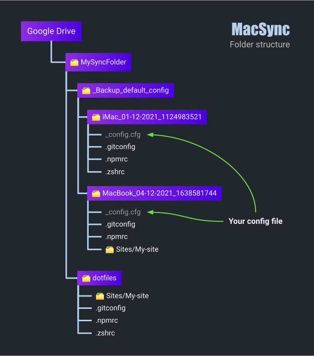

<div style="text-align: center;">
    <a href="https://github.com/Pilaton/MacSync">
        
    </a>
    <h1>🍁🔆 MacSync</h1>
    <div>Easy sync for macOS. Dotfiles, folders, configurations, etc.</div>
</div>

## Contents

- [What is it](#what-is-it)
- [Installing and configuration](#installing-and-configuration)
- [Usage](#usage)
- [Folder structure](#folder-structure)
- [How it works](#how-it-works)

## What is it

MacSync is a simple application that helps you sync the files and folders you need between your Mac devices.

Synchronize your files through any cloud storage ([Dropbox](https://dropbox.com), [Google Drive](https://google.com/drive/), [Microsoft OneDrive](https://www.microsoft.com/microsoft-365/onedrive/online-cloud-storage), [Apple iCloud](https://icloud.com), [Yandex.Disk](https://disk.yandex.ru) and others), your own server, NAS, [GitHub](https://github.com) or whatever.

## Installing and configuration

1. Download the project and go to the project folder

```bash
# Download the project to the directory you need
git clone https://github.com/Pilaton/MacSync.git --depth=1

# Go to the project folder
cd MacSync/
```

2. Configuring `config/config.cfg`

```bash
########### YOUR CONFIG ############

# Synchronization folder path
#
# Example: ~/Dropbox/MySyncFolder
#
SYNC_FOLDER=~/Dropbox/MySyncFolder


# List of files and folders to sync
# File and folder paths start from the user's home directory ($ ~/)
#
# Example: BACKUP_FILES=(Sites/mySite .oh-my-zsh/custom .gitconfig .zshrc .npmrc)
#
BACKUP_FILES=(Sites/mySite .oh-my-zsh/custom .gitconfig .zshrc .npmrc)
```

## Usage

Once you have configured `config/config.cfg`, run MacSync.

```bash
# Launch MacSync with the command
make install
# OR
zsh ./bin/install.zsh
```

After launch, you will be offered options to choose from (below is a diagram).


Let's go over some points.

`Disable sync`

This command launches the return of synchronized files to your device and removes their symlinks.  
To avoid problems, files are not deleted from the sync folder.

`Connect and replace all files in it`

This command connects your device to the sync folder by first deleting it completely, then re-creating it and adding your new files to it.

`Connect and update obsolete files`

This command connects your device to the sync folder, adding your new files to it.  
If some files already exist and the date they were edited is older than yours, they will be updated.

`Connect only`

This command simply connects your device to the sync folder.  
💡 Note: Only those files that are specified in your config file and if they exist in the sync folder will be synchronized.

## Folder structure

After you specify the path to the sync folder and the list of synced files in `config/config.cfg`, and run the application, you get the following directory structure:



I will also leave the directory scheme in its usual form. 😉

```bash
📂 MySyncFolder
├── 📂 _Backup_default_config
│   └── 📂 iMac_01-12-2021_1124983521
│   │   ├── _config.cfg
│   │   ├── .gitconfig
│   │   ├── .otherconfig
│   │   └── .zshrc
│   │
│   └── 📂 MacBook_04-12-2021_1638581744
│       ├── 📂 .oh-my-zsh
│       │   └── 📂 custom
│       ├── 📂 Sites
│       │   └── 📂 My-site
│       ├── _config.cfg
│       ├── .gitconfig
│       ├── .npmrc
│       └── .zshrc
│
└── 📂 dotfiles
    ├── 📂 .oh-my-zsh
    │   └── 📂 custom
    ├── 📂 Sites
    │   └── 📂 My-site
    ├── .gitconfig
    ├── .otherconfig
    ├── .npmrc
    └── .zshrc
```

`📂 _Backup_default_config`

This folder contains folders with backups of the original files of your devices.  
💡 Note: A backup happens every time you start MacSync.

`📂 _Backup_default_config/'your-device_date_timestamp'`

These folders contain the actual backups of the original files themselves.  
They will also store your `config.cfg`

💡 Note: The "original files" are those that are specified in the config file:  
`BACKUP_FILES=(Sites/mySite .oh-my-zsh/custom .gitconfig .zshrc .npmrc)`

`📂 dotfiles`

This folder contains files that are synced between your devices.

## How it works

What happens when you start syncing on your device for the first time:

1. The application creates the required folders.
1. Takes a list of your files and makes a backup.
1. Then it moves your files to the sync folder `📂 dotfiles`
1. Instead of your files, symlinks are created on your device to the original files in the sync folder.

This way, all your devices can be connected to the same files. 😎

## License

MIT © [Pilaton](https://github.com/Pilaton)
